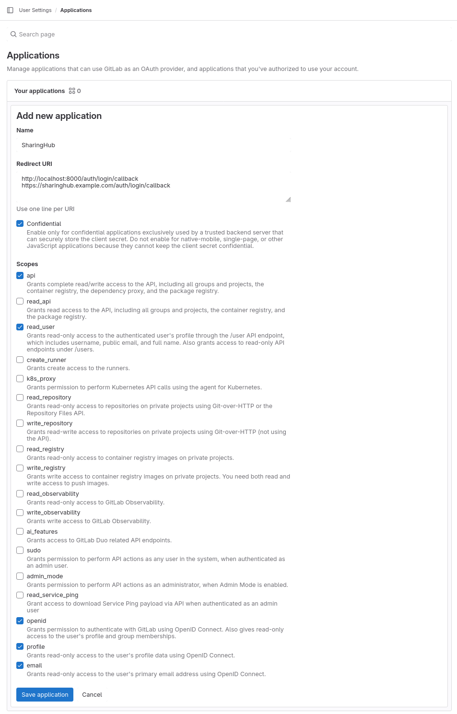

# SharingHub

The Helm charts are in the [SharingHub repository](https://github.com/csgroup-oss/sharinghub), in the folder `deploy/helm/sharinghub`.
A more complete Deployment Guide can be found in [SharingHub's README.md](https://github.com/csgroup-oss/sharinghub/blob/main/README.md#deployment-guide).

## Preparation steps

### Create a secret key

The server needs a secret key for security purposes, create the secret:

```bash
kubectl create secret generic sharinghub --from-literal session-secret-key="<uuid>" --namespace sharinghub
```

### Configure a Gitlab Application for authentication

You will need to create an application in your Gitlab instance in order to use SharingHub.

Configure an application in the GitLab instance for OpenID connect authentication:

Callback URLs example:

```txt
http://localhost:8000/api/auth/login/callback
https://sharinghub.<domain-name>/api/auth/login/callback
```

> Note: localhost URL is for development purposes, if you don't want it you can remove it.



You will be given a secret, and an application id, we will use them to create the following secret:

```bash
kubectl create secret generic sharinghub-oidc --from-literal client-id="<application-id>" --from-literal client-secret="<application-secret>" --namespace sharinghub
```

If you want, you can also set a default token, allowing use to use SharingHub without being authenticated, because the token will be used as default. The default token can be a personal Access Token, or a Group Access Token. Group tokens needs at least the role `Reporter`, and the scopes `read_api`, `read_repository`. Personal tokens needs `api` scope.

The secret creation will look like this:

```bash
kubectl create secret generic sharinghub-oidc  --from-literal default-token="<default-token>" --from-literal client-id="<client-id>" --from-literal client-secret="<client-secret>" --namespace sharinghub
```

## Deploy Sharinghub

Next, create a file called `sharinghub.yaml`:

```yaml
apiVersion: argoproj.io/v1alpha1
kind: Application
metadata:
  name: sharinghub
  namespace: argocd
spec:
  destination:
    namespace: sharinghub
    server: https://kubernetes.default.svc
  project: default
  source:
    repoURL: https://github.com/csgroup-oss/sharinghub.git
    path: deploy/helm/sharinghub
    targetRevision: main
    helm:
      valuesObject:
        config: |-
          # Here you have a configuration example, for more go https://github.com/csgroup-oss/sharinghub-server/blob/main/CONFIGURATION.md
          gitlab:
            url: https://gitlab.<domain_name>

          docs:
            url: https://sharinghub.<domain_name>/docs

          stac:
            projects:
              cache-timeout: 30
            search:
              cache-timeout: 20
            extensions:
              eo: https://stac-extensions.github.io/eo/v1.1.0/schema.json
              label: https://stac-extensions.github.io/label/v1.0.1/schema.json
              sci: https://stac-extensions.github.io/scientific/v1.0.0/schema.json
              ml-model: https://stac-extensions.github.io/ml-model/v1.0.0/schema.json
            root:
              id: gitlab-cs
              title: SharingHub brings your data and models closer.
              description: Your platform for collaborating on ML and NLP projects store in [GitLab](https://gitlab.com) instance STAC catalog.
              locales:
                fr:
                  title: SharingHub rapproche vos données et vos modèles.
                  description: Votre plateforme de collaboration sur les projets ML et NLP stockés dans le catalogue STAC de l'instance [GitLab](https://gitlab.com).
            categories:
              - ai-model:
                  title: "AI Models"
                  description: "AI models are the core of our platform, go and browse them to discover our models."
                  gitlab_topic: sharinghub:aimodel
                  logo: https://data.web.<domain_name>/sharinghub/ai-model.jpg
                  icon: https://img.icons8.com/material/24/artificial-intelligence.png
                  locales:
                    fr:
                      title: "Modèles IA"
                      description: "Les modèles d'IA sont au cœur de notre plateforme, allez les parcourir pour découvrir nos modèles."
                  features:
                    map-viewer: enable
                    store-s3: enable
                    mlflow: enable
              - dataset:
                  title: "Datasets"
                  description: "Datasets are very important in the process of training an AI, discover those that we put at your disposal."
                  gitlab_topic: sharinghub:dataset
                  logo: https://data.web.<domain_name>/sharinghub/datasets.jpg
                  icon: https://img.icons8.com/ios/50/data-backup.png
                  locales:
                    fr:
                      title: "Jeux de données"
                      description: "Les jeux de données sont très importants dans le processus de formation d'une IA, découvrez ceux que nous mettons à votre disposition."
                  features:
                    map-viewer: enable
                    store-s3: enable
                    mlflow: disable

          tags:
            gitlab:
              minimum_count: 1
            sections:
              - name: "Computer Vision"
                enabled_for:
                  - ai-model
                  - dataset
                keywords:
                  - "Image qualification"
                  - "Object detection"
                  - "Image segmentation"
                  - "Mask generation"
              - name: "Multimodal"
                keywords:
                  - "Feature Extraction"
                  - "Text-to-Image"
                  - "Image-to-3D"
                  - "Text-to-3D"
                enabled_for:
                  - ai-model
                  - dataset
              - name: "Tabular"
                keywords:
                  - "Tabular Classification"
                  - "Tabular Regression"
                enabled_for:
                  - ai-model
                  - dataset

          alerts:
            timeout: 3
            type: info
            title: "Welcome to SharingHub"
            message: "To see all projects and unlock all features, please login..."
            locales:
              fr:
                title: "Bienvenue sur le SharingHub"
                message: "Pour voir tous les projets et débloquer toutes les fonctionnalités, veuillez vous connecter..."

        image:
          repository: eoepca/sharinghub
          pullPolicy: IfNotPresent
          # Overrides the image tag whose default is the chart appVersion.
          tag: "latest"

        ingress:
          enabled: true
          className: "nginx"
          annotations:
            cert-manager.io/cluster-issuer: letsencrypt-prod
            nginx.ingress.kubernetes.io/ssl-redirect: "true"
            nginx.ingress.kubernetes.io/proxy-body-size: 10g
          hosts:
            - host: sharinghub.<domain_name>
              paths:
                - path: /
                  pathType: ImplementationSpecific
          tls:
            - secretName: sharinghub.<domain_name>-tls
              hosts:
                - sharinghub.<domain_name>

  syncPolicy:
    syncOptions:
      - FailOnSharedResource=true
      - CreateNamespace=true
    automated:
      selfHeal: true
```

You will need to fill some fields:

- `<domain_name>` with your platform domain name (ex: example.com).

And, if you created an S3 bucket, complete the configuration (`spec.source.helm.valuesObject.config`).

```yaml
config: |-
  s3:
    enable: true
    bucket: <s3-bucket>
    region: <s3-region>
    endpoint: https://<s3-endpoint>
```

If you want to learn more about the configuration, go to [Administration > Configuration](../../configuration.md#sharinghub).

Once the configuration for the server satisfies you, apply the Application manifest:

```bash
kubectl apply -f sharinghub.yaml
```
