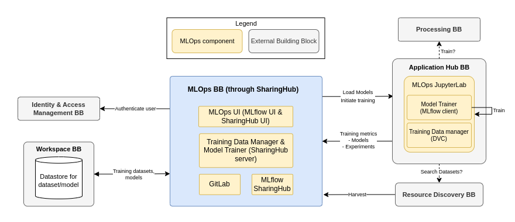

# Architecture

!!! info
    All of the architecture analysis is a work in progress, and will evolve. :construction_worker:

## Overview

The MLOps BB provides support services for training of machine learning models within the cloud platform. To this end the following capabilities must be provided:

- Initiate training runs, with support for the most popular machine learning frameworks.
- Provide for each training run the resultant metrics to assess model performance.
- Maintain a history of training runs including the associated parameterization and model metrics.
- Manage training data - with support for versioning and registration as discoverable resources.
- Establish model versions - maintaining the model assets in S3 object storage.
- Register versioned models for Resource Discovery via Resource Registration.

In accordance with the architecture and to facilitate collaborative development,
the MLOps BB follows a modular design.

<figure markdown="span">
  { width="500" }
  <figcaption>High-level architecture</figcaption>
</figure>

Model artifacts (associated with training runs) are maintained in the object storage associated to the
user/project Workspace - represented in a format that is agnostic to the underlying model framework.
Models and training data can be versioned and registered for publication via the Workspace resource
registration/discovery services.

### Components

#### Model Trainer

**_Initiation and management of training runs and model artefacts._**

The Model Trainer should support all popular ML frameworks - such as tensorflow, pytorch, etc. - and with an appropriate model artefact representation, such as ONNX. It supports initiation of model training runs with specific parameterization and training data - and provides an API through metrics regarding each model run are recorded - used to maintain a history of all details pertaining to training runs.

The Model Trainer integrates with the Workspace BB for storage and publishing of model artefacts. For discovery, the model should be expressed as a STAC item - for example using the [`ml-model`](<https://github.com/stac-extensions/ml-model>) extension.

#### Training Data Manager

**_Management of training data._**

The Trainer Data Manager integrates with the Workspace BB for publishing, (and possibly also storage), of ML training data. For discovery, the training data should be expressed as STAC items [[RD22]](https://eoepca.readthedocs.io/projects/architecture/en/latest/document-references/#rd22) - informed by the work of the Earth Observation Training Data Lab [[RD31]](https://eoepca.readthedocs.io/projects/architecture/en/latest/document-references/#rd31).

#### MLOps UI

**_Web-enabled UI for interactive management of models, training runs and training data._**

The MLOps UI provides a web-enabled UI through which the model training can be orchestrated, including initiation of training runs and the history of training run outcomes.

## Implementation

The SharingHub is the component used to implement the features of the MLOps Building Block.

The SharingHub promotes productivity, collaboration and efficient development in the field of AI
and machine learning. It offers seamless integration with popular AI frameworks and libraries,
streamlined data management capabilities and facilitates the sharing and reuse of AI models and
geospatial datasets.

<figure markdown="span">
  { width="800" }
  <figcaption>MLOps Architecture with SharingHub components and other Building Blocks</figcaption>
</figure>

Very light, SharingHub is deployed on top of a GitLab instance, and dynamically extracts metadata
from GitLab projects to serve them through its web interface, as well as a normalized API.
Its main API implements the STAC specification, and more precisely the STAC API, providing a
standardized API, offering interoperability with other Building Blocks.

The ML lifecycle is managed with MLflow, that can be directly integrated into GitLab, or deployed by itself.
Being a really popular and widely used ML management solution, MLflow is compatible with a lot of frameworks
and ML formats (like ONNX).

The management of large amounts of data is achieved through integration with DVC. Data Version Control (DVC) lets you capture the versions of your data and models in Git commits, while storing them on-premises or in cloud storage.
