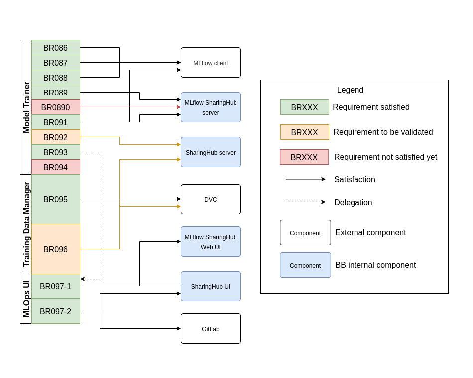

# Requirements

You can find here a detailed list of requirements, clearly specifying the desired features and behaviors that the system must meet.

<figure markdown="span">
  { width="600" }
  <figcaption>MLOps requirements satisfaction</figcaption>
</figure>

!!! info
    This analysis is a work in progress, and will evolve. :construction_worker:

## Model Trainer

- **BR086**: The Model Trainer shall support management of machine learning training - covering models developed in the most popular machine learning frameworks, such as TensorFlow, PyTorch, Keras, etc.
- **BR087**: The Model Trainer shall support management of machine learning models using interoperable model representations, such as ONNX.
- **BR088**: The Model Trainer shall support initiation of training runs and provide the resultant metrics to assess model performance.
- **BR089**: The Model Trainer shall maintain a history of runs, including associated parameterization, training datasets and model metrics. Each run should be associated with the persisted model output assets.
- **BR090**: The Model Trainer shall persist model assets within platform storage, including integration within user/project workspace.
- **BR091**: The Model Trainer shall support applying versions to generated models.
- **BR092**: The Model Trainer shall support registration of versioned models within Resource Discovery - e.g. to publish for sharing.
- **BR093**: The Model Trainer shall provide a Web UI with access to the training run history, through which model runs can be managed and assessed for performance [[**BR097-1**] :material-tag-arrow-left:](#BR097).
- **BR094**: The Model Trainer shall support integration as service within the Workspace BB.

## Training Data Manager

- **BR095**: The Training Data Manager shall support version-controlled management of training datasets. The approach to training dataset management should facilitate discovery and reuse, by use of appropriate metadata standards such as STAC extensions [Resource Discovery RD23].
- **BR096**: The Training Data Manager shall support registration of versioned ML training data within Resource Discovery - e.g. to publish for sharing.

## MLOps UI

- <a name="BR097" class="anchor">**BR097**</a>: The MLOps UI shall provide a web-enabled UI that provides:
    - **BR097-1**: Access to the training run history, through which model runs can be managed and assessed for performance.
    - **BR097-2**: Access to training data, for purposes of management, versioning etc.
