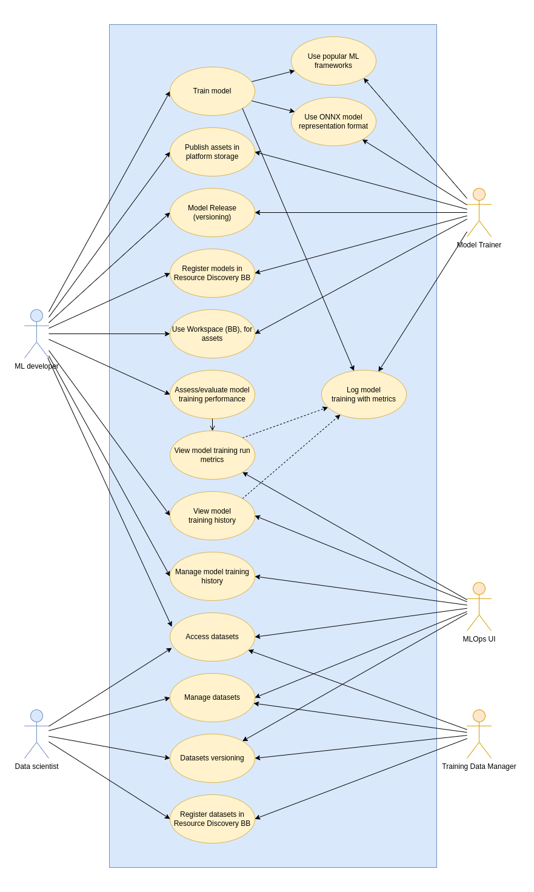

# Use Cases

A global overview of the use cases for the MLOps components from a user point of view.

!!! note
    Based on [Design > Requirements](./requirements.md).

## Diagram

<figure markdown="span">
  
  <figcaption>Use Case diagram of MLOps BB</figcaption>
</figure>

## User stories

### AI Model evaluation and release management 

This use case covers all aspects of training AI models, utilizing popular frameworks, handling model assets, versioning, managing model training runs and their performance metrics and models registering for discovery and reuse.

#### Create model

- **Actors**: ML Developer, ML Trainer.
- **Descritpion**: As an _ML Developer_, I want to create a new project to train an AI model regardless of the AI framework used.

#### Use popular ML framewoks

- **Actors**: ML Developer, ML Trainer.
- **Descritpion**: As an _ML Developer_, I want to use popular popular machine learning frameworks for training models with the Model Trainer.

#### Use ONNX model representation format

- **Actors**: ML Developer, ML Trainer.
- **Descritpion**: As an _ML Developer_, I want to use the ONNX (Open Neural Network Exchange) format for training models with the Model Trainer.

#### Evaluate AI model training

- **Actors**: ML Developper, ML trainer.
- **Description**: As an _ML developer_, I want to record my model's accuracy metrics to keep the most efficient version in production with the Model Trainer.

#### Display runs metrics

- **Actors**: ML Developper, MLOps UI.
- **Description**: As an _ML developer_, I want to see performance metrics collected during experiments associated to model with MLOps UI.

#### View Model training history

- **Actors**: ML Developper, ML trainer, MLOps UI.
- **Description**: As an _ML developer_, I want to have visual access to the training metrics history of my AI model, and his datasets version used with MLops UI.

#### Share Model:

- **Actors**: ML Developer, MLOps UI.
- **Description**: As an _ML Developer_, I want to share my model with others collaborator with MLOps UI.

- **Actors**: ML Developer, ML trainer, MLOps UI. 
- **Description**: As an _ML Developer_, I want to visually the historical training metrics of the models  that i have permission to view, so that i can monitor performance trends and make data-driven decisions.

#### Model Release

- **Actors**: ML Developer, ML trainer.
- **Description**: As an _ML developer_, I would like to be able to download ONNX (Open Neural Network Exchange) version of the model that I need.

#### Register Models in Resource Discovery BB

- **Actors**: ML Developer, ML trainer.
- **Description**: As an _ML developer_, I want to register my models with the Model Trainer in the Resource Discovery Building Block for easy discovery and reuse.

### Dataset management

This use case focuses on efficiently storing, accessing, managing, versioning, and registering datasets to ensure they are easily discoverable and reusable, promoting streamlined workflows and data consistency across projects.

#### Publish Assets

- **Actors**: Data scientist, Training Data Manager.
- **Description**: As a _Data scientist_, I want to store a large quantity (several GB) of data in all formats (**images**, **sounds**, **text**, **videos**) to train AI models. 

#### Dataset iteration

- **Actors**: Data scientist, Training Data Manager.
- **Description**: As a _Data scientist_, I want to have several versions of my dataset, so that i can iterate according to my needs.

#### Share Dataset

- **Actors**: Data scientist, Training Data Manager.
- **Description**: As a _Data scientist_, I want to share my dataset with **Resource Discovery** or others standard services as assets.

#### Browse Dataset

- **Actors**: Data scientist, MLOps UI.
- **Description**: As a _Data scientist_, I want to have access to available dataset to which i have permissions, and to be able to contribute.

- **Actors**: ML Developer, MLOps UI
- **Description**: As an _ML developer_, I want to use available dataset to train my model.
